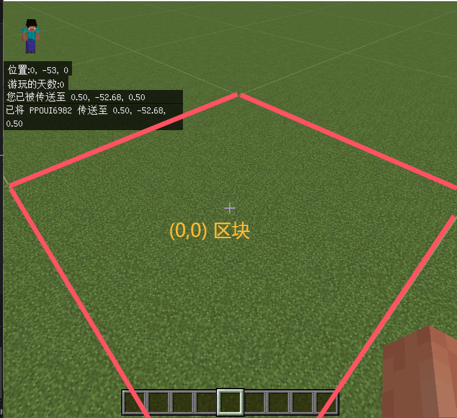
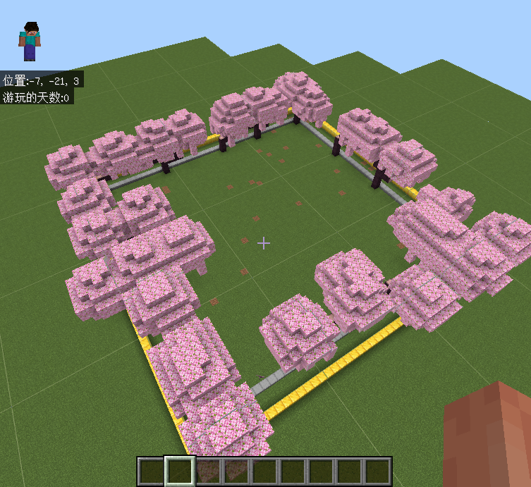
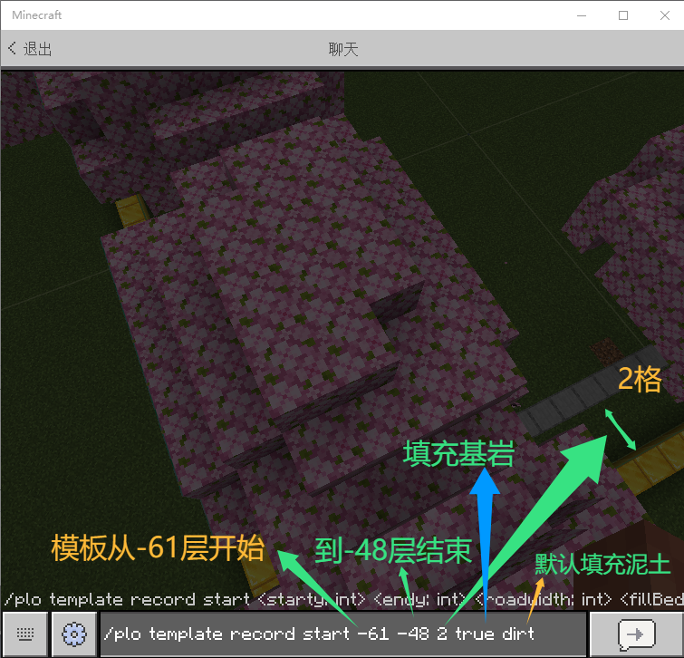
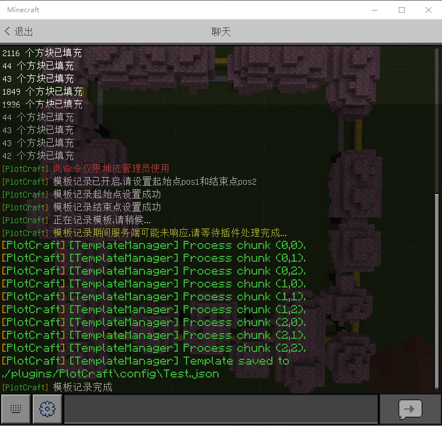
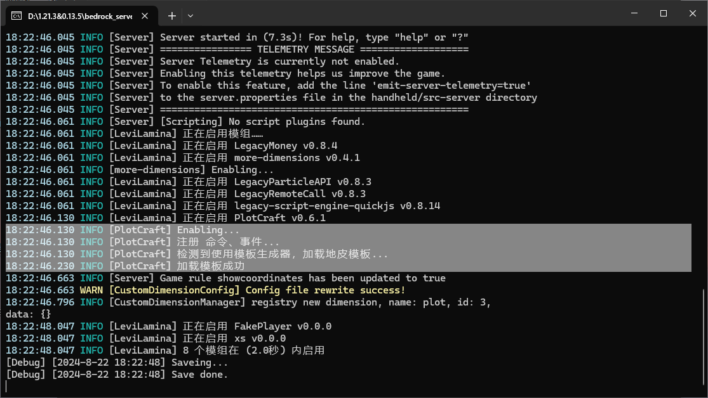
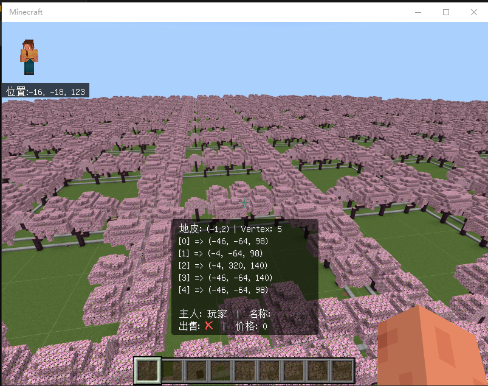

# 地皮模板系统

地皮模板系统分为：

- [模板记录器](#模板记录器)
- [模板生成器](#模板生成器)

## 模板记录器

“模板记录器” 又名 “模板制作器”，用于记录模板信息，并生成模板文件。

### 准备工作

1. 安装 Levilamina 并带有 PlotCraft 插件(模组)
2. 准备一张超平坦地图(由于模板生成的特性，建议使用超平坦地图)
3. 启动服务端，并使用 `/plo op <Name>` 将自己添加为管理员

### 模板建造

1. 在前面准备工作完成后，进入服务器

2. 进入服务器后，我们首先找到 (0,0) 区块



> Tip  
> Minecraft 的每个区块大小为 16x16  
> 我们可以直接使用 `/tp 0 ~ 0` 命令快速到达 (0,0) 区块

3. 在找到 (0,0) 区块后，我们要确定模板的大小(区块数量)

> Tip  
> 一个区块的长款为 16x16  
> 地皮大小 = 区块 \* 16  
> 例如：我们需要一个 48x48 大小的地皮，那么我们需要 3x3 个区块

4. 确定好模板大小后，我们需要找到对角的区块

> Tip  
> 例如：我们需要一个 48x48 大小的地皮，那么我们需要 3x3 个区块，那么对角区块就是 (2,2) 区块  
> 我们可以直接使用命令传送到计算出来的对角区块 `/tp 47 ~ 47`


> 为了演示方便，笔者使用方块圈出了范围

5. 在确定以上信息后，我们可以开始建造模板了



> 为了演示，随便种了点樱花树

### 模板记录

1. 在模板建造好后，我们回到 (0,0) 区块，执行以下命令

```
/plo template record start <starty: int> <endy: int> <roadwidth: int> <fillBedrock: Boolean> <defaultBlock: Block>
```

> Tip:  
> <starty: int> 为模板开始层(开始层以下的方块都不会被记录)  
> <endy: int> 为模板结束层(结束层以上的方块都不会被记录)  
> <roadwidth: int> 为模板道路的宽度(由于模板是 1:1 生成，道路宽度会被\*2，这里填写原始值即可)  
> <fillBedrock: Boolean> 为是否填充底部基岩  
> <defaultBlock: Block> 为默认填充方块(因为 starty 以下的方块不会被记录，模板会使用此默认方块进行生成)



2. 在执行完命令后，再执行 `/plo template record pos1` 设置点 1

3. 设置点 1 后，我们去到对角区块，执行命令 `/plo template record pos2` 设置点 2

4. 最后执行以下命令，插件将开始记录模板

```
/plo template record execute <fileName: string>
```

> Tip:  
> <fileName: string> 为模板文件名



> Tip:  
> 记录完成后或者出现错误，可以使用`/plo template record reset`命令重置模板  
> 重置后需重新执行 1~4 步

## 模板生成器

在前面我们完成了模板记录后，我们就可以使用模板生成器来生成模板了

1. 关闭服务器，打开插件目录下的 `config.json` 文件

2. 修改 `generator.type` 为 `Template`

3. 在 `generator.templateFile` 处填写刚刚生成的模板文件名

```json
{
  "generator": {
    "type": "Template",
    "templateFile": "Test.json"
  }
}
```

> Tip  
> 笔者演示时生成的文件为 `Test.json`，请根据实际情况填写

> ⚠ Warning  
> 模板文件需要放在 config 目录下，路径中不能含有任何中文字符  
> 配置好模板生成器后，需删除存档或使用 Amulet 删除地皮维度区块使生成器重新生成区块

4. 在配置好 config 后，启动服务器，插件(模组)会在 Enable 阶段解析并加载模板



5. 进入服务器，传送到地皮维度，即可看到生成的模板


